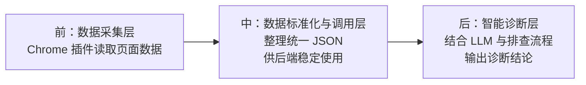

# 智能诊断助手项目

## 项目目标

这个项目的目标是开发一款智能诊断助手，通过 `Chrome 插件 + 本地后端` 的方式，把技术支持排查任务的过程逐步智能化。

希望最终实现：

- 自动化数据采集：从多个系统页面自动读取诊断所需数据
- 智能诊断分析：基于规则、检索和模型进行问题判断
- 快速反馈结论：直接输出问题、证据和处理建议
- 知识持续沉淀：把历史诊断案例逐步沉淀成可复用知识

## 三层结构

这个项目可以理解成前中后 3 层。

### 1. 数据采集层

负责回答两个问题：

- 页面里有哪些数据值得采
- 这些数据应该用什么结构输出

这一层主要做：

- 识别页面类型和当前子页
- 判断数据区域在哪里
- 抽取页面中的表格、键值对、日志、YAML 等内容
- 输出统一 JSON

这一层不负责诊断结论，只负责把页面变成结构化数据入口。

### 2. 数据标准化与汇总层

负责把采集到的数据整理成后端可以稳定消费的格式。

这一层主要做：

- 统一字段命名
- 区分基础信息和当前子页信息
- 对不同页面的数据做统一 schema 设计
- 为后续接入更多系统页面留出扩展方式

可以理解为：采集层解决“拿到什么”，这一层解决“怎么整理成后端可用数据”。

### 3. 诊断与知识层

负责基于采集到的数据，逐步把技术支持排查过程变成智能化过程。

当前 demo 状态：

- 主要还是基于 LLM 做判断和结果输出
- 还不是最终完整的诊断后端

未来方向：

- 逐步结合技术支持排查经验
- 把经验判断沉淀成更稳定的诊断能力
- 让诊断结果不只依赖单次模型输出

这一层解决的是“如何基于数据形成更智能的诊断结论”。

## 当前仓库处于什么阶段

当前仓库主要还是在前两层，重点是把页面数据稳定抓出来，并形成统一 JSON。

诊断层现在还是 demo 验证阶段，还不是最终完整后端。

## 当前目录说明

### `page-blueprint-capture`

页面蓝本采集插件。

作用：

- 在接入新页面或新子页时，先采集页面蓝本
- 先摸清页面里有哪些数据、哪些字段值得保留
- 再由人决定生产版插件应该采哪些字段、如何标准化输出

### `diagnosis-data-collector`

生产版页面采集插件。

作用：

- 抓取当前业务页面
- 输出更稳定的结构化 JSON
- 作为后端正式消费的数据输入

### `status-log-llm-demo`

本地后端 LLM 分析 demo。

作用：

- 接收插件上传的完整采集 JSON
- 提取其中的 `statusLogInfo`
- 调用模型返回分析结果

说明：

- 这是后端 demo
- 不是最终完整诊断后端

### `llm-diagnosis-demo`

插件侧联调 demo。

作用：

- 保留页面抓取流程
- 抓到 JSON 后直接调用 `status-log-llm-demo`
- 在插件中展示 LLM 返回结果

说明：

- 这是“采集插件 + 本地分析服务”的联调 demo
- 用来验证链路，不代表最终完整产品形态

## 当前推荐理解方式

如果从项目阶段来理解，可以这样看：

1. `page-blueprint-capture`
   用来摸清新页面的数据蓝本。

2. `diagnosis-data-collector`
   用来稳定采集生产可用 JSON。

3. `status-log-llm-demo` + `llm-diagnosis-demo`
   用来验证“采集数据 -> 发给后端 -> 返回分析结果”的完整链路。

## 相关文档

- `PROJECT_OVERVIEW.md`：更详细的项目背景和当前采集能力说明
- `DATA_COLLECTION_LAYER.md`：数据采集层的定位、流程和扩展方法
